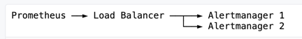

* goal
  * Alertmanager's core concepts

## Grouping

* Grouping
  * 💡alerts' SIMILAR nature -> fire 1! notification💡 / ALL information is displayed
  * use cases
    * larger outages / MANY systems fail -> hundreds to thousands of alerts are fired SIMULTANEOUSLY
  * way to configure
    * | [alertmanager's configuration file](configuration.md)

## Inhibition

* Inhibition
  * 💡if OTHER alerts are ALREADY fired -> suppress notifications / certain alerts 💡
    * == mute alertS -- based on the -- presence of another alertS
  * _Example:_ alert is fired / entire cluster is NOT reachable
    * -> mute ALL OTHER alerts
  * use cases
    * prevent notifications for hundreds or thousands of firing alerts / ⚠️UNRELATED⚠️ to the CURRENT issue
  * way to configure
    * | [alertmanager's configuration file](configuration.md)

## Silences

* Silences
  * == mute alerts | given time
  * way to configure
    * -- based on -- matchers
      * if an incoming alert match ALL silence's matchers -> NO notification sent / that alert
    * | Alertmanager UI

## Client behavior

* follow [Alerts API](alerts_api.md)

## High Availability

* Alertmanager
  * allows
    * configuring a cluster of Alertmanagers (== > alertmanager instances) / high availability
  * way to configure
    * -- via -- CL's flag [--cluster-*](https://github.com/prometheus/alertmanager#high-availability)
    
    

* recommendations
  * ❌NOT set dedicated load balancer❌
    * Reason:🧠Prometheus Alertmanager does NOT handle fine the alerts🧠

    
